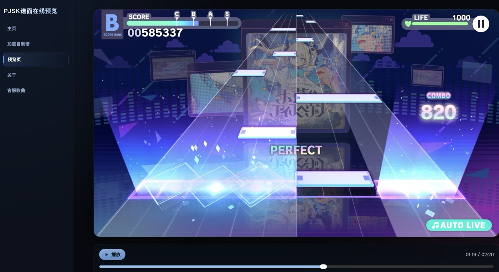

# sekai-mmw-preview-web

Project SEKAI 风格 SUS 预览器（Web 版）。



支持纯 wasm 渲染的谱面与 Overlay HUD（分数/血量/combo/PERFECT/开场信息卡）、Unity 风格原生 AP 结尾演出、本地文件上传与 PWA 缓存。

## 页面路由

- `/`：主页
- `/upload`：上传自制谱页面
- `/preview`：预览页面
- `/about`：关于页面

说明：

- 如果 URL 带 `sus`/`cfg`/`config` 等预览参数，即使不是 `/preview`，也会自动跳转到 `/preview`。

## 功能概览

- SUS 解析与 WebAssembly 原生渲染
- 音轨与谱面同步（支持 `offset`）
- 纯 wasm Overlay HUD、背景生成与开场信息层
- AP 结尾演出（按 Unity 动画与粒子效果原生逐帧绘制，不依赖视频）
- 可选自制谱 Info（原曲信息下方显示制谱图标、谱面标题与谱面作者）
- 本地上传 SUS/BGM/曲绘
- 背景亮度调节（60%~100%）
- 可选显示锁屏组件，便于录屏
- PWA + Service Worker 按需缓存
- 移动端高 DPR 预览适配

## 快速开始

环境要求：

- Node.js 20+
- npm 10+
- Emscripten（`emcc` 可执行）
- sus2json 源码：[watagashi-uni/Sekai-SUS-Parser](https://github.com/watagashi-uni/Sekai-SUS-Parser)

安装与开发：

```bash
npm install
npm run dev
```

说明：

- 日常联调建议使用 `npm run dev`。
- 如果你要验证 wasm 产物、PWA、Service Worker 或部署结果，请先执行 `npm run build`，再执行 `npm run preview`。

生产构建与预览：

```bash
npm run build
npm run preview
```

### sus2json 构建依赖

`npm run build` 会把 [Sekai-SUS-Parser](https://github.com/watagashi-uni/Sekai-SUS-Parser)
中的 `SusToJsonCpp` 编译为浏览器使用的 WebAssembly。默认目录结构为：

```text
workspace/
├── sekai-mmw-preview-web/
└── Sekai-SUS-Parser/
    └── SusToJsonCpp/
```

可以在本项目目录下执行以下命令准备源码：

```bash
git clone https://github.com/watagashi-uni/Sekai-SUS-Parser ../Sekai-SUS-Parser
```

如果源码不在默认位置，可通过 `SEKAI_SUS_TO_JSON_ROOT` 指向 `SusToJsonCpp` 目录：

```bash
SEKAI_SUS_TO_JSON_ROOT=/path/to/Sekai-SUS-Parser/SusToJsonCpp npm run build
```

## 资源同步脚本说明

脚本默认从项目同级目录查找 MikuMikuWorld、OpenSekai 和 overlay 资源，也可用
`MMW_ROOT`、`OPENSEKAI_RESULT_ROOT`、`PJSK_OVERLAY_ROOT` 等环境变量覆盖资源位置。

## URL 预览参数

### 1. 基础 query 方式

```text
/preview?sus=<sus-url>&bgm=<bgm-url>&cover=<cover-url>&offset=<ms>
```

### 2. `config` / `cfg` 方式（推荐）

可以把参数打包成 JSON 放进 `config` 或 `cfg`，解析器支持：

- 原始 JSON 字符串
- URL Encode 后的 JSON
- Base64URL(JSON)

字段映射：

| 含义 | 长键 | 短键 | 必填 |
| --- | --- | --- | --- |
| SUS 地址 | `sus` | `s` | 是 |
| BGM 地址 | `bgm` | `b` | 否 |
| 曲绘地址 | `cover` | `c` | 否 |
| 偏移毫秒 | `offset` | `o` | 否 |
| 曲名 | `title` | `t` | 否 |
| 作词 | `lyricist` | `ly` | 否 |
| 作曲 | `composer` | `co` | 否 |
| 编曲 | `arranger` | `ar` | 否 |
| 演唱 | `vocal` | `v` | 否 |
| 难度 | `difficulty` | `d` | 否 |
| 自制谱 Info | `info` | `i` | 否 |
| 谱面标题 | `scoreTitle` | `st` | 否 |
| 谱面作者 | `scoreCreator` | `sc` | 否 |
| 第一行描述覆盖 | `description1` | `d1` | 否 |
| 第二行描述覆盖 | `description2` | `d2` | 否 |
| 额外信息 | `extra` | `e` | 否 |

难度 `d/difficulty` 支持：

- 数字：`0~6`（`EASY/NORMAL/HARD/EXPERT/MASTER/APPEND/ETERNAL`）
- 文本：`EASY/NORMAL/HARD/EXPERT/MASTER/APPEND/ETERNAL`

自制谱 Info 推荐直接传对象；只要提供 `info`、`scoreTitle` 或 `scoreCreator` 就会启用，也可用 `customScoreInfo=false` 显式关闭：

```json
{
  "i": {
    "title": "谱面标题",
    "creator": "谱面作者"
  }
}
```

`offset` 说明：

- 单位毫秒。
- 传 `9000` 表示音频延后 9 秒（常用于官服资源）。
- 不传时会尝试读取 SUS 内 `#WAVEOFFSET`。

### 3. `cfg` 示例（可直接打开）

```text
https://chartview.unipjsk.com/preview?cfg=eyJzIjoiaHR0cHM6Ly9hc3NldHMudW5pcGpzay5jb20vc3RhcnRhcHAvbXVzaWMvbXVzaWNfc2NvcmUvMDEyN18wMS9hcHBlbmQiLCJiIjoiaHR0cHM6Ly9hc3NldHMudW5pcGpzay5jb20vb25kZW1hbmQvbXVzaWMvbG9uZy9zZV8wMTI3XzAxL3NlXzAxMjdfMDEubXAzIiwiYyI6Imh0dHBzOi8vYXNzZXRzLnVuaXBqc2suY29tL3N0YXJ0YXBwL211c2ljL2phY2tldC9qYWNrZXRfc18xMjcvamFja2V0X3NfMTI3LnBuZyIsIm8iOjkwMDAsImQiOjUsInQiOiLjg4jjg7Pjg4fjg6Ljg6_jg7Pjg4Djg7zjgroiLCJseSI6InNhc2FrdXJlLlVLIiwiY28iOiJzYXNha3VyZS5VSyIsImFyIjoic2FzYWt1cmUuVUsoS2V5IOWyuOeUsOWLh-awlyjmnInlvaLjg6njg7Pjg5rjgqTjgrgpKSIsInYiOiLlpKnppqzlj7gsIEtBSVRPLCDps7PjgYjjgoAsIOiNieiWmeWvp-OAhSwg56We5Luj6aGeIn0
```

### 4. 前端生成 `cfg`（Base64URL）示例

```js
function toBase64UrlUtf8(text) {
  const bytes = new TextEncoder().encode(text)
  let bin = ''
  for (const b of bytes) bin += String.fromCharCode(b)
  return btoa(bin).replace(/\+/g, '-').replace(/\//g, '_').replace(/=+$/g, '')
}

const cfgObj = {
  s: 'https://example.com/chart.sus',
  b: 'https://example.com/song.mp3',
  c: 'https://example.com/cover.png',
  o: 9000,
  d: 5,
  t: 'Song Title',
  ly: 'Lyricist',
  co: 'Composer',
  ar: 'Arranger',
  v: 'Vocal',
}

const cfg = toBase64UrlUtf8(JSON.stringify(cfgObj))
const url = `https://chartview.unipjsk.com/preview?cfg=${cfg}`
```

## 本地上传模式

- `/upload` 页面可以选择本地 SUS/BGM/曲绘并填写歌曲信息。
- `/preview` 在没有 URL 参数时也支持本地加载。

## PWA 与缓存

- 已启用 Service Worker（`vite-plugin-pwa` + custom `src/sw.ts`）。
- 大体积资源（`assets/mmw/**`、wasm）改为按需请求后缓存，不会在安装时整包预热。
- 字体资源会进入预缓存，减少首次进入预览时的字体闪烁和重复拉取。
- 右下角会显示更新提示（发现新版本 -> 立即更新）。
- 首次进入预览时会加载较大的字体资源，移动端首开可能需要稍等几秒。

## 常见问题排查

1. `register failed` 或 `add-to-cache-list-conflicting-entries`

- 先确认部署的是最新 `dist`。
- 浏览器里执行：
  - DevTools -> Application -> Service Workers -> `Unregister`
  - DevTools -> Application -> Clear storage -> `Clear site data`
- 然后强刷（`Ctrl/Cmd + Shift + R`）。

2. 看不到 SW / 缓存

- 必须在 HTTPS 或 localhost 下。
- 先执行 `npm run build`，再执行 `npm run preview`。
- 检查 DevTools 是否勾选了 `Bypass for network`。

3. 手机画面模糊 / 锯齿明显

- 当前预览会按设备 DPR 自适应渲染分辨率。
- 如果仍觉得不够清晰，先确认没有开启“低分辨率”。
- 某些旧移动设备会因为性能自动表现较弱，优先在横屏全屏下测试。

3. 远程 SUS/BGM/曲绘加载失败

- 检查资源地址是否可直接访问。
- 检查目标站点 CORS。

## 致谢与许可证

本项目使用并改造了以下开源项目：

- [crash5band/MikuMikuWorld](https://github.com/crash5band/MikuMikuWorld)（MIT）
- MikuMikuWorld MIT License: [LICENSE](https://github.com/crash5band/MikuMikuWorld/blob/master/LICENSE)
- [TootieJin/pjsekai-overlay-APPEND](https://github.com/TootieJin/pjsekai-overlay-APPEND)（AGPL）

由于引入 AGPL 代码，本项目按 **AGPL-3.0-only** 发布。

- 项目许可证：`/LICENSE`

## 开发者

- 綿菓子ウニ: [https://space.bilibili.com/622551112](https://space.bilibili.com/622551112)
- GitHub: [https://github.com/watagashi-uni/sekai-mmw-preview-web](https://github.com/watagashi-uni/sekai-mmw-preview-web)
